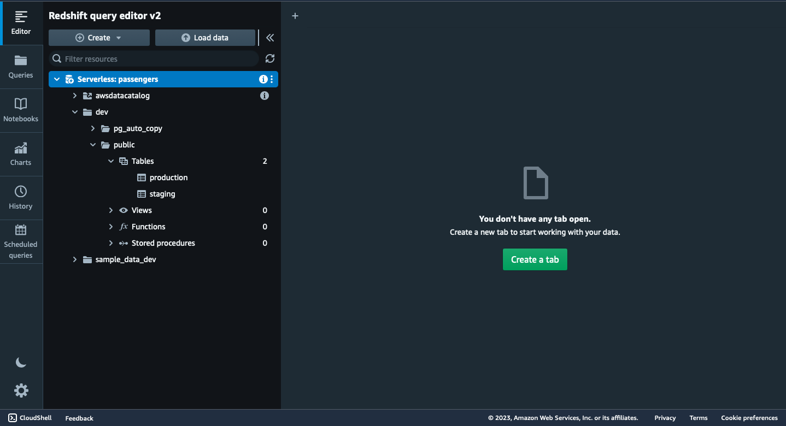
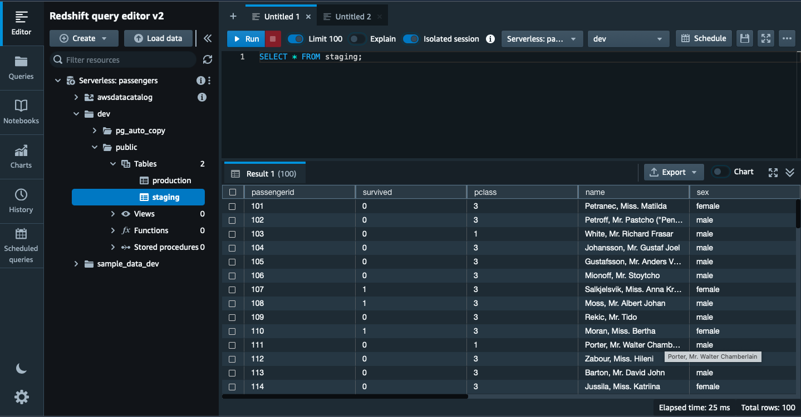
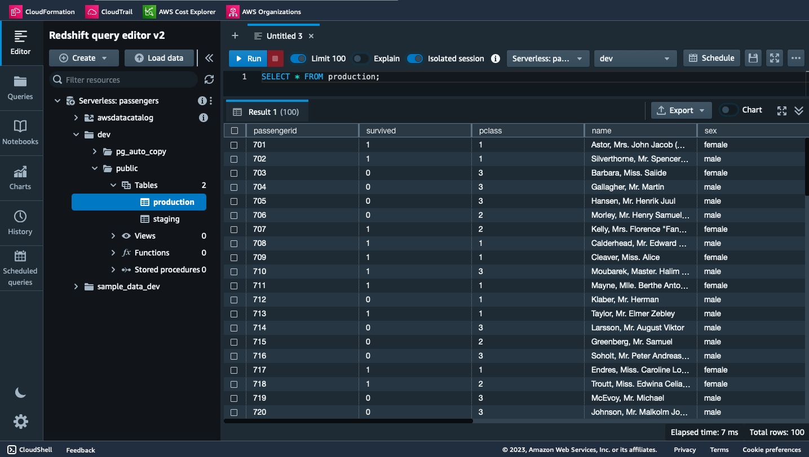
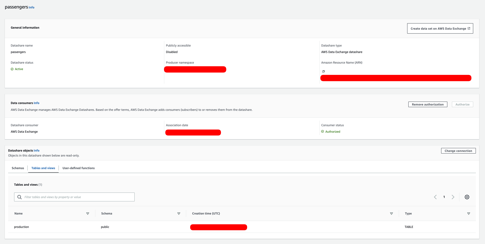

## Prerequisite

Ensure that the AWS CLI is configured and ready to work with AWS. For additional information, refer to the [documentation](https://docs.aws.amazon.com/cli/latest/userguide/cli-chap-configure.html). AWS allows you to configure credentials via environment variables, the IAM Identity Center, or a configuration file. For more information, please visit this [page](https://docs.aws.amazon.com/cli/latest/userguide/cli-chap-configure.html).

For this guide, let's assume the local CLI session is configured to work with AWS. For example, it can mean that environment variables are set:

```bash
export AWS_ACCESS_KEY_ID=<AWS Access Key ID>
export AWS_SECRET_ACCESS_KEY=<AWS Secret Access Key>
export AWS_DEFAULT_REGION=<AWS Region>
``` 

Ensure that the user or role used in the CLI session has sufficient permissions to execute the actions outlined in this guide.

## Overview

This guide helps deploy the following architecture:


## Create S3 bucket

To create an S3 bucket as the source, execute the following commands:
```bash
aws cloudformation create-stack --stack-name <STACK_NAME> \
    --template-body file://01-s3-bucket/template.yml \
    --parameters ParameterKey=BucketName,ParameterValue='<S3_DATA_BUCKET_NAME>' \
    --query 'StackId' --output text
aws cloudformation wait stack-create-complete --stack-name <STACK_NAME>
aws cloudformation describe-stacks --stack-name <STACK_NAME> --query 'Stacks[0].Outputs' --output table
```

The script above deploys a CloudFormation stack with the name `<STACK_NAME>` using the [template](./01-s3-bucket/template.yml) and returns outputs from the stack deployed. The template defines an S3 bucket with server-side encryption. This bucket will be used as a source of the data (`.parquet`) and for Lambda deployments. Parameter with name `<S3_BUCKET_NAME>` is required and should be provided. 

In the example below, `<STACK_NAME>` is replaced with `club-innocent-s3`, `<S3_BUCKET_NAME>` with `club-innocent-us-east-1`:
```bash
aws cloudformation create-stack --stack-name club-innocent-s3 \
    --template-body file://01-s3-bucket/template.yml \
    --parameters ParameterKey=BucketName,ParameterValue='club-innocent-us-east-1' \
    --query 'StackId' --output text
aws cloudformation wait stack-create-complete --stack-name club-innocent-s3
aws cloudformation describe-stacks --stack-name club-innocent-s3 --query 'Stacks[0].Outputs' --output table

-----------------------------------------------------------------------------------------------
|                                       DescribeStacks                                        |
+------------------------------------+-------------+------------------------------------------+
|             Description            |  OutputKey  |               OutputValue                |
+------------------------------------+-------------+------------------------------------------+
|  The ARN of the created S3 bucket  |  BucketArn  |  arn:aws:s3:::club-innocent-us-east-1  |
|  The name of the created S3 bucket |  BucketName |  club-innocent-us-east-1               |
+------------------------------------+-------------+------------------------------------------+
```

## Upload .parquet file to created S3 bucket

To upload a file to an S3 bucket, use the `aws s3 cp` command:
```
aws s3 cp <PATH_TO_FILE> s3://<BUCKET_NAME>/
```

In the example below the `.parquet` file is located in the current working directory and has name [`titanic.parquet`](https://www.tablab.app/view/parquet?datatable-source=demo-titanic), the name of the S3 bucket has been taken from the previous step:
```bash
aws s3 cp ./titanic.parquet s3://club-innocent-us-east-1/data/

upload: ./titanic.parquet to s3://club-innocent-us-east-1/data/titanic.parquet
``` 

Note: the .parquet file format is a columnar data format. To inspect .parquet files, use tools like [`parquet-tools`] (https://github.com/hangxie/parquet-tools) to view file contents before uploading to S3 bucket.

## Create VPC (optional)

This step is optional. If you already have a deployed VPC (with subnets and security groups), please proceed to the next step.

To deploy a VPC with high availability and fault tolerance, execute the following command:
```bash
aws cloudformation create-stack --stack-name <STACK_NAME> \
    --template-body file://02-vpc/template.yml \
    --parameters ParameterKey=CIDRBlock,ParameterValue='<VPC_CIDR_BLOCK_VALUE>' \
                 ParameterKey=DeployNATGateway1,ParameterValue='<DEPLOY_NAT_GATEWAY_1>' \
                 ParameterKey=DeployNATGateway2,ParameterValue='<DEPLOY_NAT_GATEWAY_2>' \
    --query 'StackId' --output text
aws cloudformation wait stack-create-complete --stack-name <STACK_NAME>
aws cloudformation describe-stacks --stack-name <STACK_NAME> --query 'Stacks[0].Outputs' --output table
```

The script above deploys a CloudFormation stack with the name `<STACK_NAME>` using the [template](./02-vpc/template.yml) and returns outputs from the stack deployed. The template defines a VPC with three public and three private subnets in three availability zones to achieve high availability and fault tolerance. Additionally, the VPC is equipped with a dedicated Internet Gateway. By default, NAT Gateways are not deployed, but they can be optionally added to provide outgoing internet connectivity for resources in the private subnets.
The template establishes two security groups, one for public and another for private resources. Only connections originating from the public security group are permitted to access the private security group.


In the example below, `<STACK_NAME>` is replaced with `club-innocent-vpc`, and default values for parameters are used:
```bash
aws cloudformation create-stack --stack-name club-innocent-vpc \
    --template-body file://02-vpc/template.yml \
    --query 'StackId' --output text
aws cloudformation wait stack-create-complete --stack-name club-innocent-vpc
aws cloudformation describe-stacks --stack-name club-innocent-vpc --query 'Stacks[0].Outputs' --output table

--------------------------------------------------------------------------------------------------------
|                                            DescribeStacks                                            |
+----------------------------------------------+--------------------------+----------------------------+
|                  Description                 |        OutputKey         |        OutputValue         |
+----------------------------------------------+--------------------------+----------------------------+
|  The ID of the created VPC                   |  VpcID                   |  vpc-02c12c124663789op     |
|  The ID of the created Public Subnet 1       |  PublicSubnet1Id         |  subnet-0c82be60af536c872  |
|  The ID of the created Public Subnet 2       |  PublicSubnet2Id         |  subnet-0efdf272744c33sse  |
|  The ID of the created Public Subnet 3       |  PublicSubnet3Id         |  subnet-009d191fec1018eg2  |
|  The ID of the created Private Subnet 3      |  PrivateSubnet3Id        |  subnet-052a9561552fbe73c  |
|  The ID of the created Private Subnet 2      |  PrivateSubnet2Id        |  subnet-08122d03450de78ed  |
|  The ID of the created Private Subnet 1      |  PrivateSubnet1Id        |  subnet-0754793cb34114ea7  |
|  The ID of the created Public Security Group |  PublicSecurityGroupId   |  sg-04aa035df3ff378ed      |
|  The ID of the created Private Security Group|  PrivateSecurityGroupId  |  sg-08d8c4c444e78el19      |
+----------------------------------------------+--------------------------+----------------------------+
```

## Deploy Redshift Serverless

To deploy Redshift Serverless, execute the following command:
```bash
aws cloudformation create-stack --stack-name <STACK_NAME> \
    --template-body file://03-redshift-serverless/template.yml \
    --parameters ParameterKey=NamespaceName,ParameterValue='<NAMESPACE_NAME>' \
                 ParameterKey=WorkgroupName,ParameterValue='<WORKGROUP_NAME>' \
                 ParameterKey=DatabaseName,ParameterValue='<DATABASE_NAME>' \
                 ParameterKey=AdminUsername,ParameterValue='<ADMIN_USERNAME>' \
                 ParameterKey=AdminUserPassword,ParameterValue='<ADMIN_USER_PASSWORD>' \
                 ParameterKey=BaseRPU,ParameterValue='<BASE_RPU>' \
                 ParameterKey=PubliclyAccessible,ParameterValue='<PUBLICLY_ACCESSIBLE>' \
                 ParameterKey=SubnetIds,ParameterValue='<SUBNET_IDS>' \
                 ParameterKey=SecurityGroupIds,ParameterValue='<SECURITY_GROUP_IDS' \
                 ParameterKey=LogExportsList,ParameterValue='<LOG_EXPORTS_LIST>' \
                 ParameterKey=EnhancedVpcRouting,ParameterValue='<ENHANCED_VPC_ROUTING>' \
    --capabilities CAPABILITY_NAMED_IAM \
    --query 'StackId' --output text
aws cloudformation wait stack-create-complete --stack-name <STACK_NAME>
aws cloudformation describe-stacks --stack-name <STACK_NAME> --query 'Stacks[0].Outputs' --output table
```

The script above deploys a CloudFormation stack with the name `<STACK_NAME>` using the [template](./03-redshift-serverless/template.yml) and returns outputs from the stack deployed. The template defines Redshift Serverless Workgroup and Namespace, deployed into three subnets for high availability. If you don't have a deployed VPC with subnets and security groups, look into the step above.

In the example below, `<STACK_NAME>` is replaced with `club-innocent-redshift-serverless, `<NAMESPACE_NAME> is `titanic`, `<WORKGROUP_NAME>` is substituted for `passengers`. Subnets (private) and security groups (private) IDs are taken from the previous example, default values for parameters are used:

```bash
aws cloudformation create-stack --stack-name club-innocent-redshift-serverless \
    --template-body file://03-redshift-serverless/template.yml \
    --parameters ParameterKey=NamespaceName,ParameterValue='titanic' \
                 ParameterKey=AdminUserPassword,ParameterValue='tsbHH8KUisPtXxje' \
                 ParameterKey=WorkgroupName,ParameterValue='passengers' \
                 ParameterKey=SubnetIds,ParameterValue='subnet-052a9561552fbe73c\,subnet-08122d03450de78ed\,subnet-0754793cb34114ea7' \
                 ParameterKey=SecurityGroupIds,ParameterValue='sg-08d8c4c444e78el19' \
    --capabilities CAPABILITY_NAMED_IAM \
    --query 'StackId' --output text
aws cloudformation wait stack-create-complete --stack-name club-innocent-redshift-serverless
aws cloudformation describe-stacks --stack-name club-innocent-redshift-serverless --query 'Stacks[0].Outputs' --output table

--------------------------------------------------------------------------------------------------------------------------------------------------------------------------------------------
|                                                                                      DescribeStacks                                                                                      |
+------------------------------------------------------------------------------------+--------------------------+--------------------------------------------------------------------------+
|                                     Description                                    |        OutputKey         |                               OutputValue                                |
+------------------------------------------------------------------------------------+--------------------------+--------------------------------------------------------------------------+
|  The name of the created Redshift Serverless Workgroup                             |  WorkgroupName           |  passengers                                                              |
|  The database name of the created Redshift Serverless Workgroup                    |  WorkgroupDatabase       |  dev                                                                     |
|  The ARN of the created S3 Read-Only Access Role for Redshift Serverless Namespace |  S3ReadOnlyAccessRoleArn |  arn:aws:iam::************:role/redshift-s3-access-titanic-us-east-1  |
|  The host of the created Redshift Serverless Workgroup                             |  WorkgroupHost           |  club-innocentpassengers.************.us-east-1.redshift-serverless.amazonaws.com  |
|  The port of the created Redshift Serverless Workgroup                             |  WorkgroupPort           |  5439                                                                    |
+------------------------------------------------------------------------------------+--------------------------+--------------------------------------------------------------------------+
```

## Deploy Lambda function

Checkout psycopg2 Python Library for AWS Lambda and copy to [source code] (./04-lambda/src):
```bash
svn checkout https://github.com/jkehler/awslambda-psycopg2/trunk/psycopg2-3.7 ./04-lambda/src/psycopg2
```

To deploy the Lambda function, the [source code](./04-lambda/src) should be zipped and uploaded to the designated S3 bucket. To do so, execute the next statements:
```bash
cd ./04-lambda/src && zip -r ../deploy.zip . && cd ../../
aws s3 cp ./04-lambda/deploy.zip s3://<BUCKET_NAME>/lambda/copy-s3-to-redshift/deploy.zip
```

In the example below, the bucket created before is used:
```bash
cd ./04-lambda/src && zip -r ../deploy.zip . && cd ../../
aws s3 cp ./04-lambda/deploy.zip s3://club-innocent-us-east-1/lambda/copy-s3-to-redshift/deploy.zip

updating: psycopg2/ (stored 0%)
updating: psycopg2/_json.py (deflated 63%)
updating: psycopg2/extras.py (deflated 73%)
updating: psycopg2/_psycopg.cpython-39-x86_64-linux-gnu.so (deflated 66%)
updating: psycopg2/errorcodes.py (deflated 65%)
updating: psycopg2/tz.py (deflated 62%)
updating: psycopg2/_range.py (deflated 72%)
updating: psycopg2/_ipaddress.py (deflated 56%)
updating: psycopg2/__init__.py (deflated 56%)
updating: psycopg2/extensions.py (deflated 58%)
updating: psycopg2/errors.py (deflated 46%)
updating: psycopg2/sql.py (deflated 71%)
updating: psycopg2/pool.py (deflated 68%)
updating: lambda_function.py (deflated 54%)
upload: 04-lambda/deploy.zip to s3://club-innocent-us-east-1/lambda/copy-s3-to-redshift/deploy.zip
```

To deploy the Lambda function, execute the following command:
```bash
aws cloudformation create-stack --stack-name <STACK_NAME> \
    --template-body file://04-lambda/template.yml \
    --parameters ParameterKey=CodeS3Bucket,ParameterValue='<S3_BUCKET_NAME>' \
                 ParameterKey=CodeS3Key,ParameterValue='lambda/copy-s3-to-redshift/deploy.zip' \
                 ParameterKey=SubnetIds,ParameterValue='<SUBNET_IDS>' \
                 ParameterKey=SecurityGroupIds,ParameterValue='<SECURITY_GROUPS_IDS>' \
                 ParameterKey=RedshiftIAMRole,ParameterValue='<REDSHIFT_IAM_ROLE>' \
                 ParameterKey=RedshiftHost,ParameterValue='<REDSHIFT_HOST>' \
                 ParameterKey=RedshiftPort,ParameterValue='<REDSHIFT_PORT>' \
                 ParameterKey=RedshiftUser,ParameterValue='<REDSHIFT_USER>' \
                 ParameterKey=RedshiftPassword,ParameterValue='<REDSHIFT_PASSWORD>' \
                 ParameterKey=RedshiftDatabase,ParameterValue='<REDSHIFT_DATABASE>' \
    --capabilities CAPABILITY_NAMED_IAM \
    --query 'StackId' --output text
aws cloudformation wait stack-create-complete --stack-name <S3_BUCKET_NAME>
aws cloudformation describe-stacks --stack-name <S3_BUCKET_NAME> --query 'Stacks[0].Outputs' --output table
```

The script above deploys a CloudFormation stack named `<STACK_NAME>` using the provided [template](./04-lambda/template.yml) and returns outputs from the deployed stack. The template defines a Python Lambda function that copies data from an S3 file to a Redshift table. The parameters of the template can be split into three groups. The first group (`CodeS3Bucket`, `CodeS3Key`) determines the location where the zip archive with the function source code is stored. The second group (`SubnetIds`, `SecurityGroupsIds`) configures the VPC settings for the Lambda function. Ensure that network connections are possible between the Redshift Serverless and the chosen subnets and security groups. Attaching the Lambda function to the VPC allows for connecting and executing statements on the Redshift Serverless without making the database publicly accessible.

The third group of parameters (`RedshiftHost`, `RedshiftPort`, `RedshiftUser`, `RedshiftPassword`, `RedshiftDatabase`) specifies the connection parameters for the Redshift Serverless. The `RedshiftIAMRole` parameter determines the IAM role used by the Redshift Serverless to read data from the S3 bucket. For implementation details, refer to the function's [handler](./04-lambda/src/lambda_function.py).

In the example below, the Lambda function is deployed into the public subnets with the public security group. The Redshift connection parameters is used from the deployment above:
```bash
aws cloudformation create-stack --stack-name club-innocent-s3-to-redshift-lambda \
    --template-body file://04-lambda/template.yml \
    --parameters ParameterKey=CodeS3Bucket,ParameterValue='club-innocent-us-east-1' \
                 ParameterKey=CodeS3Key,ParameterValue='lambda/copy-s3-to-redshift/deploy.zip' \
                 ParameterKey=SubnetIds,ParameterValue='subnet-0c82be60af536c872\,subnet-0efdf272744c33sse\,subnet-009d191fec1018eg2' \
                 ParameterKey=SecurityGroupIds,ParameterValue='sg-04aa035df3ff378ed' \
                 ParameterKey=RedshiftIAMRole,ParameterValue='arn:aws:iam::************:role/redshift-s3-access-titanic-us-east-1' \
                 ParameterKey=RedshiftHost,ParameterValue='club-innocentpassengers.************.us-east-1.redshift-serverless.amazonaws.com' \
                 ParameterKey=RedshiftPort,ParameterValue='5439' \
                 ParameterKey=RedshiftUser,ParameterValue='admin' \
                 ParameterKey=RedshiftPassword,ParameterValue='tsbHH8KUisPtXxje' \
                 ParameterKey=RedshiftDatabase,ParameterValue='dev' \
    --capabilities CAPABILITY_NAMED_IAM \
    --query 'StackId' --output text
aws cloudformation wait stack-create-complete --stack-name club-innocent-s3-to-redshift-lambda
aws cloudformation describe-stacks --stack-name club-innocent-s3-to-redshift-lambda --query 'Stacks[0].Outputs' --output table

-------------------------------------------------------------------------------------------------------------------------------------------
|                                                             DescribeStacks                                                              |
+------------------------------------------+---------------+------------------------------------------------------------------------------+
|                Description               |   OutputKey   |                                 OutputValue                                  |
+------------------------------------------+---------------+------------------------------------------------------------------------------+
|  The name of the created Lambda Function |  FunctionName |  copy-from-s3-to-redshift                                                    |
|  The ARN of the created Lambda Function  |  FunctionArn  |  arn:aws:lambda:eu-central-1:************:function:copy-from-s3-to-redshift  |
+------------------------------------------+---------------+------------------------------------------------------------------------------+
```

## Create Redshift tables 

To create tables (`staging` and `production`) in the Redshift Serverless, [Redshift Data API](https://docs.aws.amazon.com/redshift/latest/mgmt/data-api-calling.html) can be use:
```bash
aws redshift-data execute-statement \
    --workgroup-name '<WORKGROUP_NAME>' \
    --database '<DATABASE_NAME>' \
    --sql " \
        CREATE TABLE <TABLE_NAME> ( \
            <TABLE_STRUCTURE>
        );" \
    --query 'Id' --output text
```

The script above starts the creation of table `<TABLE_NAME>` and returns the statement execution ID. Ensure that appropriate [permissions](https://docs.aws.amazon.com/redshift/latest/mgmt/data-api-access.html) are configured for the Redshift Data API to execute the script seamlessly. The execution ID can be used to check the metadata about the execution or fetch the result of the execution:
```bash
aws redshift-data describe-statement \
    --id <STATEMENT_ID> \
    --query 'Status' --output text

aws redshift-data get-statement-result \
    --id <STATEMENT_ID> \
    --query 'Status' --output text
```

In the example below, two tables (`staging` and `production`) are created to support [`titanic.parquet`](./titanic.parquet) file in the workgroup (`passengers`) and database (`dev`) created before:
```bash
aws redshift-data execute-statement \
    --workgroup-name passengers \
    --database dev \
    --sql " \
        CREATE TABLE staging ( \
            passengerid bigint, \
            survived bigint, \
            pclass bigint, \
            name character varying(256), \
            sex character varying(256), \
            age double precision, \
            sibsp bigint, \
            parch bigint, \
            ticket character varying(256), \
            fare double precision, \
            cabin character varying(256), \
            embarked character varying(256) \
        );" \
    --query 'Id' --output text

aws redshift-data execute-statement \
    --workgroup-name passengers \
    --database dev \
    --sql " \
        CREATE TABLE production ( \
            passengerid bigint, \
            survived bigint, \
            pclass bigint, \
            name character varying(256), \
            sex character varying(256), \
            age double precision, \
            sibsp bigint, \
            parch bigint, \
            ticket character varying(256), \
            fare double precision, \
            cabin character varying(256), \
            embarked character varying(256) \
        );" \
    --query 'Id' --output text
```

Following the execution, newly appeared tables can now be found in the [Redshift Query Editor](https://aws.amazon.com/redshift/query-editor-v2/):


## Trigger Lambda function to copy .parquet file from S3 into the table

To invoke the Lambda function, that copies the `.parquet` file upload to the S3 to the Redshift Table, execute the following statement:
```bash
aws lambda invoke \
    --function-name <FUNCTION_NAME> \
    --payload '{"table": "<TABLE_NAME>", "s3_file_url": "<S3_FILE_URL>"}' \
    --cli-binary-format raw-in-base64-out \
    <RESPONSE_FILE_PATH>
```

The script above invokes the Lambda function. The function expects to receive a JSON with input containing information about the source S3 .parquet file and the target table in the Redshift Serverless. For more information see the function's [source code](./04-lambda/src/lambda_function.py).

In the example below, data from the previous upload `.parquet` file (`s3://club-innocent-us-east-1/data/titanic.parquet`) is copied into `staging` table:
```bash
aws lambda invoke \
    --function-name arn:aws:lambda:eu-central-1:************:function:copy-from-s3-to-redshift \
    --payload '{"table": "staging", "s3_file_url": "s3://club-innocent-us-east-1/data/titanic.parquet"}' \
    --cli-binary-format raw-in-base64-out \
    ./response.json
{
    "StatusCode": 200,
    "ExecutedVersion": "$LATEST"
}
```

After the Lambda function successful invocation, the `staging` table is populated with data:


## Push data from STAGING to PRODUCTION tables

To transfer data between tables [Redshift Data API](https://docs.aws.amazon.com/redshift/latest/mgmt/data-api-calling.html) can be leveraged:
```bash
aws redshift-data execute-statement \
    --workgroup-name '<WORKGROUP_NAME>' \
    --database '<DATABASE_NAME>' \
    --sql " \
        INSERT INTO <DESTINATION_TABLE> (<COLUMN_1>, <COLUMN_2>, ...) \
        SELECT <COLUMN_1>, <COLUMN_2>, ... \
        FROM <SOURCE_TABLE>;" \
    --query 'Id' --output text
```

The script above executes `INSERT INTO ... SELECT ... FROM` SQL statement and obtaining the execution ID. It can be used to retrieve the execution status:
```bash
aws redshift-data describe-statement \
    --id <STATEMENT_ID> \
    --query 'Status' --output text
```

In the example below, data from the `staging` table is copied into the `production` table:
```bash
aws redshift-data execute-statement \
    --workgroup-name 'passengers' \
    --database 'dev' \
    --sql " \
        INSERT INTO production ( \
            passengerid, \
            survived, \
            pclass, \
            name, \
            sex, \
            age, \
            sibsp, \
            parch, \
            ticket, \
            fare, \
            cabin, \
            embarked \
        ) \
        SELECT \
            passengerid, \
            survived, \
            pclass, \
            name, \
            sex, \
            age, \
            sibsp, \
            parch, \
            ticket, \
            fare, \
            cabin, \
            embarked \
        FROM staging;" \
    --query 'Id' --output text
```

Folowing the CLI command execution, the `production` table is populated with data from `staging` table:


## Create a datashare for the table

To create an AWS Data Exchange datashare, several steps should be executed:
1. Create a datashare with access granted on AWS Data Exchange
2. Add objects to the created datashare
3. Authorize access for the datashares for AWS Data Exchange

To create a datashare, execute the following command:
```bash
aws redshift-data execute-statement \
    --workgroup-name '<WORKGROUP_NAME>' \
    --database '<DATABASE_NAME>' \
    --sql "CREATE DATASHARE <DATASHARE_NAME> MANAGEDBY ADX;" \
    --query 'Id' --output text
```

In the example below, the datashare with name `passengers` is created:
```bash
aws redshift-data execute-statement \
    --workgroup-name 'passengers' \
    --database 'dev' \
    --sql "CREATE DATASHARE passengers MANAGEDBY ADX;" \
    --query 'Id' --output text
```

To add object to the created data share, execute the following command:
```bash
aws redshift-data execute-statement \
    --workgroup-name '<WORKGROUP_NAME>' \
    --database '<DATABASE_NAME>' \
    --sql " \
        ALTER DATASHARE <DATASHARE_NAME> ADD SCHEMA <SCHEMA_NAME>; \
        ALTER DATASHARE <DATASHARE_NAME> ADD TABLE <TABLE_NAME>; \
        ALTER DATASHARE <DATASHARE_NAME> ADD ALL TABLES IN SCHEMA <SCHEMA_NAME>;" \
    --query 'Id' --output text
```

The command above alters the existing datashare by adding various database objects to it. For more information about the types of objects that can be added, refer to the [documentation](https://docs.aws.amazon.com/redshift/latest/dg/r_ALTER_DATASHARE.html).

In the example below, the table `production` is added to the datashare:
```bash
aws redshift-data execute-statement \
    --workgroup-name 'passengers' \
    --database 'dev' \
    --sql "\
        ALTER DATASHARE passengers ADD SCHEMA public; \
        ALTER DATASHARE passengers ADD TABLE public.production;" \
    --query 'Id' --output text
```

To authorize AWS Data Exchange to have access to the datashare and return association status, the following CLI command should be executed:
```bash
aws redshift authorize-data-share \
    --data-share-arn '<DATA_SHARE_ARN>' \
    --consumer-identifier ADX 
```

To obtain the datashare ARN, you can execute the following statement:
```bash
aws redshift describe-data-shares \
    --query 'DataShares[].DataShareArn' --output text
```

In the example below, the created datashare `passengers` is authorized for AWS Data Exchange:
```bash
aws redshift describe-data-shares \
    --query 'DataShares[].DataShareArn' --output text
arn:aws:redshift:eu-central-1:************:datashare:bd003563-827b-4abb-aca9-0aff032fd3ba/passengers

aws redshift authorize-data-share \
    --data-share-arn 'arn:aws:redshift:eu-central-1:************:datashare:bd003563-827b-4abb-aca9-0aff032fd3ba/passengers' \
    --consumer-identifier ADX \
    --query 'DataShareAssociations[].Status' --output text
AUTHORIZED
```

To confirm the state of the datashare, AWS Management Console can be used:


## Security

See [CONTRIBUTING](CONTRIBUTING.md#security-issue-notifications) for more information.

## License

This library is licensed under the MIT-0 License. See the LICENSE file.